<picture>
  <source media="(prefers-color-scheme: dark)" srcset="assets/pipeline-dark.svg">
  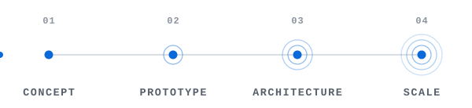
</picture>

# Hey, I'm Ricardo Leite 👋

**Software Engineer at Microsoft** &nbsp;·&nbsp; Full-stack &nbsp;·&nbsp; Distributed systems &nbsp;·&nbsp; 0→1 product engineering

**Connect with me**

  <a href="mailto:ricardo.leitejr95@gmail.com">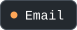</a>

---

I'm a Software Engineer at Microsoft working the 0→1 stage, taking products from concept to systems that scale. I started on Places Mobile, an iOS product built from the ground up, where I owned the infrastructure foundation — app lifecycle management, data flow architecture, telemetry — and the SwiftUI layer on top. I care as much about the interface as the infrastructure — frictionless flows, and UI considered down to the last empty state. Since then I've built space management and AI-driven tooling that automates workflows once costing teams months of manual effort. Today I lead a small engineering team and define the core architecture behind the tools Microsoft runs its workspace operations on, spanning Swift/SwiftUI, React/TypeScript, and Azure, and built to scale technically and organizationally at once. Much of that work is human: setting direction before the first commit, mentoring engineers, turning ambiguous requirements into scoped decisions, and keeping stakeholders clear on what we're building and why. Outside of that I'm usually optimizing something else — reading, lifting, cooking.

---

## Stack

**Languages**

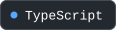  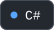  

**Frontend**

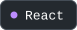 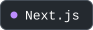 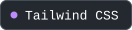 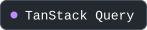 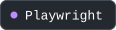

**Mobile**

  

**Backend & Cloud**

 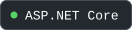  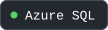  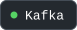 

**Data & Tooling**

    

**Applied AI**

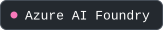 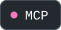  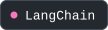 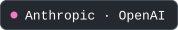  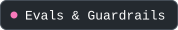

## At Microsoft

📍 &nbsp;**[Microsoft Places](https://www.microsoft.com/en-us/microsoft-teams/microsoft-places)** — Microsoft's workplace and space-management product.  
I started on Places Mobile, owning the iOS infrastructure foundation — lifecycle, data flow, telemetry.

📰 &nbsp;**[Transforming facility operations with AI maps](https://www.microsoft.com/insidetrack/blog/transforming-facility-operations-at-microsoft-with-ai-maps/)** — Microsoft Inside Track.  
How an AI-driven pipeline turns unstructured floor-plan data into reliable indoor maps.

## Projects

🗣️ &nbsp;**[Learn Native English](https://www.learnativenglish.com)** — structured CEFR A1–C2 English courses with AI conversation practice.  
Speech pipeline that scores pronunciation and intonation, then routes the result through an LLM for targeted feedback. `ElevenLabs` `OpenRouter` `Next.js` `TypeScript` `Vercel`

<b>Full stack, as text</b> — every pill above, plus the long tail, in copyable plain text

**Languages:** TypeScript, Swift, C#, Python, SQL

**Frontend:** React, Next.js, Tailwind CSS, TanStack Query, Playwright — *also:* Vitest, CSS Modules, Storybook

**Mobile:** SwiftUI, Swift, React Native

**Backend & Cloud:** Azure, ASP.NET Core, Aspire (.NET Aspire), Azure SQL, Redis, Kafka, Docker — *also:* Azure Functions, Cosmos DB, Service Bus, Azure App Service, Azure Storage, REST, OpenAPI

**Data & Tooling:** GitHub Actions, Bicep, OpenTelemetry, Application Insights, Git — *also:* Azure DevOps, Figma, VS Code, Xcode

**Applied AI:** Azure AI Foundry, MCP (Model Context Protocol), Semantic Kernel, LangChain, Anthropic · OpenAI, RAG & Vector Search, Evals & Guardrails — *also:* Open-source LLMs (Llama, Mistral, Ollama), context engineering, tool / function calling, structured outputs, prompt caching, streaming, LLM-as-judge evals, Azure AI Search, pgvector, embeddings

<b>How a 0→1 system actually lands</b> — the loop behind the header

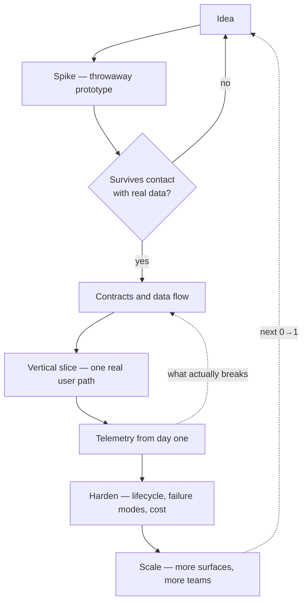

